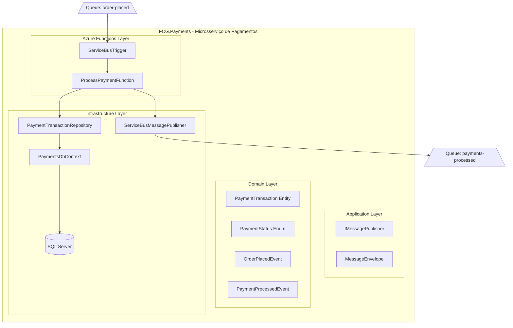
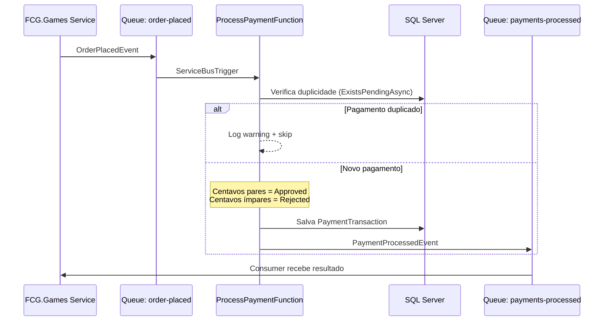

# FCG.Payments

Microsserviço de processamento de pagamentos para a plataforma FCG (FIAP Cloud Games). Processa pagamentos de compra de jogos de forma assíncrona através de Azure Functions com trigger de Azure Service Bus. Projeto da **Fase 3 do Tech Challenge — PosTech FIAP**.

## Diagrama de Arquitetura



## Fluxo de Mensagens



## Arquitetura

O projeto segue **Clean Architecture** com Azure Functions Isolated Worker (.NET 8):

```
src/
├── FCG.Payments.Domain/           # Entidades, Enums, Eventos, Interfaces (zero dependências)
├── FCG.Payments.Application/      # IMessagePublisher, MessageEnvelope
├── FCG.Payments.Infrastructure/   # EF Core, Service Bus Publisher, Repositórios
└── FCG.Payments.Functions/        # Azure Functions (ServiceBusTrigger)
tests/
├── FCG.Payments.Domain.Tests/          # Testes de entidade PaymentTransaction
├── FCG.Payments.Infrastructure.Tests/  # Testes do repositório com EF InMemory
└── FCG.Payments.Functions.Tests/       # Testes da Function com mocks
```

**Fluxo de dependências:** Domain ← Application ← Infrastructure; Functions → Application + Infrastructure

## Regra de Negócio

O processamento de pagamento usa uma regra determinística para simulação:

| Centavos do preço | Status |
|-------------------|--------|
| Pares (ex: R$ 59.**90**) | `Approved` |
| Ímpares (ex: R$ 49.**99**) | `Rejected` |

## Configuração

| Variável | Descrição | Padrão |
|----------|-----------|--------|
| `SQL_CONNECTION` | Connection string do SQL Server | `localhost SA` |
| `SERVICEBUS_CONNECTION` | Connection string do Azure Service Bus | (InMemory se vazio) |
| `APPLICATIONINSIGHTS_CONNECTION_STRING` | Application Insights | (desabilitado se vazio) |

## Build & Run

```bash
# Build
dotnet build

# Rodar testes (22 testes)
dotnet test

# Rodar Functions localmente (requer Azure Functions Core Tools)
cd src/FCG.Payments.Functions
func start
```

## Docker

```bash
docker build -f src/FCG.Payments.Functions/Dockerfile -t fcg-payments .
docker run -p 5098:80 \
  -e SQL_CONNECTION="Server=tcp:..." \
  -e SERVICEBUS_CONNECTION="Endpoint=sb://..." \
  fcg-payments
```

## Testes

22 testes com xUnit + Moq:

| Projeto | Testes |
|---------|--------|
| Domain (PaymentTransaction) | 12 |
| Infrastructure (Repository + EF InMemory) | 6 |
| Functions (ProcessPaymentFunction) | 4 |

## Tecnologias

- .NET 8.0
- Azure Functions (Isolated Worker)
- Azure Service Bus (Queues — plano Basic)
- Entity Framework Core 8 (SQL Server)
- Serilog + Application Insights
- xUnit + Moq
